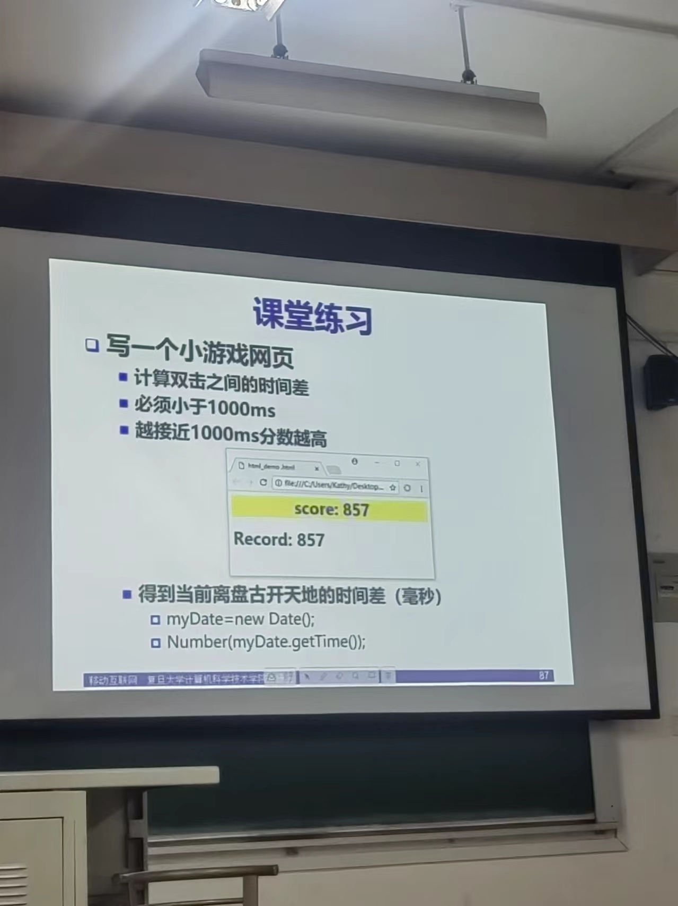
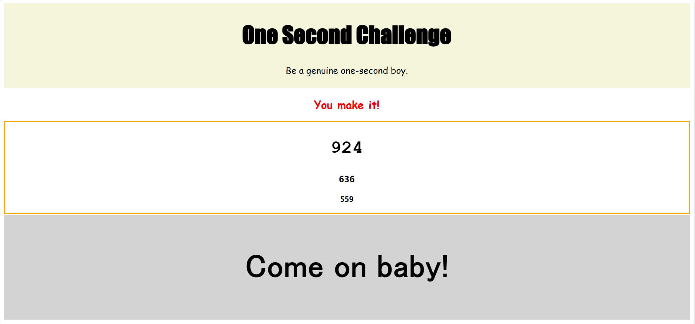
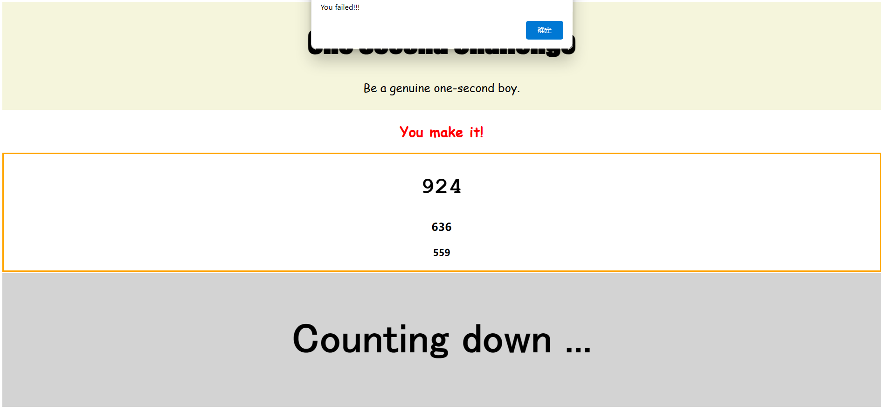

# One Second Challenge

*一个小游戏网页——基于课程 “移动互联网” 第一课课堂练习的实践*

> Be a genuine one-second boy. 

[TOC]

### 练习要求

### 运行方法

* 直接双击通过浏览器打开本文件夹（`Game_oneSecondChallenge`）中的 `index.html` 文件

### 界面与规则说明

* 在灰色区点击两次

* 显示最好三次成绩，并给出鼓励

  

* 只要超过 1s ，则游戏失败，重新开始

### 查看之前的成绩

* 在浏览器中，Ctrl + Shift + I 打开调试控制台（console）

  

  * 分数（`940`）：该轮游戏最高得分
  * `Never succeed`：该轮游戏第一次就输了！

